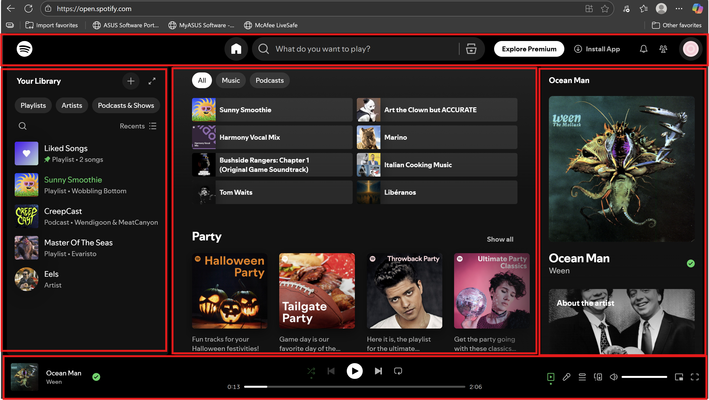

https://open.spotify.com/

Leht algab header-iga, kus paikneb bränd ja navigeerimismenüü koos skip-linkiga. Peamine sisu on main sees, jaotatud mitmeks section-iks ja vajadusel article-ks, mis hoiavad põhisisu ning kõrvalinfot aside-is. Kõik plokid on visuaalselt eristatud lihtsa CSS-iga, kasutades piire ja täidist, ning paigutus kohandub ekraani laiuse järgi (üks veerg kitsal, mitu veergu laial). Leht lõpeb footer-iga, kus on kontakt- ja autoriinfo. Struktuur järgib loogilist pealkirjahierarhiat ja on ligipääsetav, läbides W3C validaatori veavabalt.